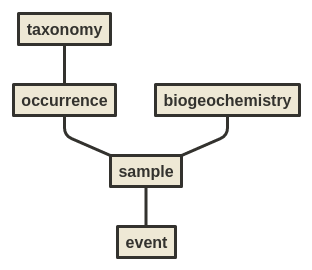

# marine-db
ECMAScript 2015 source code for processing and publishing Norwegian Polar Institute's marine data.



## Install

**Processing tools**
The command line tools require <a href="https://nodejs.org/en/">Node.js</a> (>= v9) and <a href="https://yarnpkg.com/lang/en/">yarn</a>.

```
mkdir -p ~/npolar && cd ~/npolar
git clone https://github.com/npolar/marine-db
cd marine-db/node
yarn
```

## Processing
**Create master**
```
cd ~/npolar/marine-db # must run from project root
./bin/marinedb-create-master
```
This command converts input data in `data/input` and `data/deposit` into [ND-JSON](http://ndjson.org/) in `data/master`.

The processing aims at improving the overall data quality, by normalising and schema validation.

Data with unrecognised scientific names, unknown gear, invalid dates, etc. are rejected.

All schema validation errors are logged, see `data/log`;
